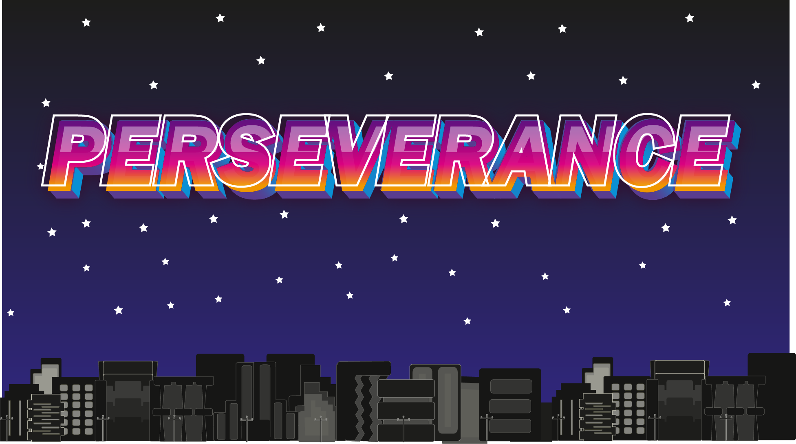

# Hi, I'm Cotbert:

<!--Image-->

- Software Developer sharing my code and thoughts
-Universidad de las Fuerzas Armadas student
- Cybersecurity enthusiast
- Currently learning about machile learning and AI
- I'm a fan of the open-source community and I'm always looking for new projects to contribute to

## 🌐 Socials:
  

# 💻 Tech Stack:
                            
# 📊 GitHub Stats:
<!--
 
-->
 

## 🏆 GitHub Trophies

### ✍️ Random Dev Quote

---

<!-- Proudly created with GPRM ( https://gprm.itsvg.in ) -->
